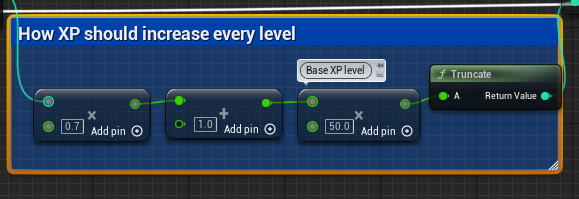

# Roguelike类型游戏设计

## 游戏设计思路

Rogue类游戏的核心内循环主要指游戏进行过程中的角色构筑循环，即打怪-升级-获取额外构筑能力-打怪-升级。为了支撑这一玩法，需要有几个核心系统来支撑，主要包含：角色系统，伤害系统等。此外，为了丰富玩法，伤害系统的基础上可以延申出技能系统，角色系统可以进一步细化角色的等级系统，怪物系统等。此外，可能还需要一定的物品系统作为辅助承载一定的功能玩法，如血瓶，宝箱等。

## 游戏管理器（BP_GameManager）

Rogue流程控制类BP_GameManager，主要负责类吸血鬼幸存者类型Roguelike游戏的内循环流程控制，即主要游玩参数的配置和初始化，战斗兵种的生成，时间控制，经验分发，以及部分UI相关的数据更新。

在游戏的启动阶段，BP_GameManager需要进行玩家方面和怪物方面的准备。

#### 数据准备

在玩家方面，需要准备一张每级对应的升级经验需求表，以及一个时间控制器。在Demo实现中，升级经验需求表是利用等级相关的公式自动生成的，即 

$$
(level * 0.7 + 1) * 50
$$

这里仅是为了保障在每级的时候都能有足量的经验升级挑战。

在怪物方面，则需要依据配置好的怪物列表进行怪物的生成配置，保证每分钟都能够产生足量的怪物。并且需要寻找合适的位置（以玩家角色为参考）进行spawn操作。

Demo采用的方法是利用EQS来在地图上以玩家为参考进行位置的打分选择：

主要的方式是：以玩家角色为圆心设定圆圈，并且具体位置到玩家是可寻路的:

### 游玩流程控制

在游戏主要循环过程中，需要随着时间和玩家角色等级提升不断提升难度，主要体现在额外数量的普通敌人和精英敌人的加入。这些也是随着敌人波次的更新而不断进行变化的，目的也是带给玩家动态的体验。

Demo中的设计采取的是简单的以一定时间间隔去进行怪物的生成，即每隔SpawnInterval就进行一定波次的怪物生成：

以一个设定的上下限进行简单随机，从而确定本波生成的怪物数量：

一个可以想到的优化设计是：以等级和时间为扰动参数，去动态的调整随机的范围，从而能够令玩家在游戏后期遇到更加动态的挑战。

在生成敌方角色时，仍然需要用到EQS的查询结果，从而保障角色之间不会产生影响生成的位置重叠：

角色实例本身的参数留待后续小节继续讲解，其主要涉及到玩法设计和数据驱动设计。

### 数据转发

因为本身设计的关系，玩家和怪物的一些数据是存放在管理器上的（而不在角色本身身上），本身这个设计是和虚幻引擎本身的设计理念有些背道而驰。但是考虑到这种游戏本身体量并不会过于庞大，将部分数据集中管理也更有利于项目的迭代。

本Demo主要是将经验等级和游戏时间进程利用BP_GameManager这个存在于关卡中的实例Actor进行存储和管理（如果按照大型项目和虚幻本身的风格，经验等级需要存储在Character或者PlayerState上，时间进程放在GameMode或者GameState上）。

所以还需要将这部分数据转发给PlayerController即其上的Widgets用以显示。

## 角色

角色设计是该类型游戏设计的又一重要模块，从最简单的方面讲，我们需要代表玩家的角色和代表敌人的角色。有一些都需要具备的属性，如生命值等等，然后通过技能来丰富角色。但是因为类幸存者游戏对敌人的设计普遍比较简单，敌人类AI也并不需要高级的行为逻辑（一般只需要径直追向玩家角色，以及死亡），从简化设计的角度，可以直接将行为逻辑写在Character上（攻击，死亡）。而相对的，玩家角色因为承担了构筑的玩法，需要以技能系统不断去丰富伤害系统，所以需要一些额外设计。（当然，敌人角色也可以以这种设计思路去进行设计，如为敌人角色增加更多的技能等，但是在本Demo中仅采取最简单的伤害系统。）

### 敌人角色

本Demo中设计了两种敌人角色：普通敌人和精英敌人。

当然，因为前文提到的简单设计原则，普通敌人和精英敌人的主要区别主要体现在数值上，即精英敌人拥有更多的生命值和更高的攻击伤害。并且在死亡后，精英敌人除了会产出经验球外，还会额外产出精英宝箱（参见后文）。

敌人对玩家的伤害主要通过专门的碰撞体进行触发：

在检测的玩家角色的碰撞后，以一定的时间间隔产生对玩家角色的伤害并播放动画和音效（这里采用的依旧是必究初级和简单的处理）。

处理外部传入的伤害，进行伤害飘字的显示，模拟受击，然后结算生命值：

以及在满足死亡条件后（生命值低于0），进行死亡的表现（动画，停止移动等等以及销毁操作）以及经验球的生成：

#### AI

敌人AI简单处理，只需要在发现玩家角色后进行追逐即可：

### 玩家角色

玩家角色指玩家在虚拟环境中的代理。虽然主体很多逻辑与敌人逻辑类似，但还是存在一些不同之处的，主要体现在：接受玩家输入的能力，以及技能的扩展上。

#### 输入与移动

为了简化玩家的操作，这里的设计是令玩家仅控制角色在虚拟环境中的移动（其他的交互操作主要通过碰撞进行触发）。

#### 技能

与普通敌人角色不同的是，本Demo着重对角色的伤害系统做了拓展开发，也是体现类幸存者Roguelike游戏的角色构筑。

正常来说，欲构建完善的技能系统，采用虚幻引擎的技能系统组件（GAS）是最合适的做法，可以有效适配技能获取升级以及和属性系统良好的交互。本项目是在蓝图尺度上对这一系统的拙劣复刻（GAS需要代码层面的深度嵌入），虽然实现了相似的功能，但是从扩展性和完善性上依然比不上GAS，但作为演示已经足够。

为了承载技能，项目中实现了一个BP_AbilityComponent蓝图，作为组件附着在角色身上（该组件也可进一步开发以对接敌人角色，从而实现更丰富的敌人功能）。角色的诸多主动和被动能力（已解锁的和未解锁的），都是以比较固定的形式进行实现，目前主要有：

闪电技能：随机选取目标进行打击；

重锤技能：以角色为圆心进行横扫打击；

火球技能：向角色最近的目标发射火球打击；

霜冻技能：向角色最近的目标进行霜冻打击。

每个技能都又若干升级的选项，具体的配置存储在一张数据表中：

其中-1代表该技能的质变选项。

当我们的经验达到了升级标准（超过了级别的经验上限），则会执行升级选项。

首先判断是否满足质变要求：

获取可以升级的技能，包括那些未获取到的技能：

在待构建的技能库中去除那些重复的不符合要求的技能（这里采用了一些字符串匹配的方法，用以判断当前拥有的技能，从而对技能库进行筛选）：

最后，如果是游戏进行到了比较后期，所有的技能已经升级完毕，那么此时给与血量作为补偿：

这里涉及到部分UI设计。即触发升级之后，PlayerController将升级的选项（技能经验等）准备好，并创建相应的UI，UI部分监听玩家的输入，当玩家确认选择后，将相应的技能或者技能升级再通知给角色。

构建升级时的UI：

在玩家确认选项后，触发回调，执行升级处理（位于PlayerController上）：

1. 恢复游戏

2. 执行技能升级

技能的升级处理是高度自定义的，也就是说每一级的升级都是自己在技能组件上进行定制。

比如闪电技能，其升级可以体现在伤害，范围等。

## 物品

### 宝箱

分为固定宝箱（BP_Chest_Fixed）和精英宝箱（BP_Chest_Elite）两种。

#### 固定宝箱（BP_Chest_Fixed）

预先布置在地图中，位置固定，内容物为回复球（也可以设定其他选项），可以设定刷新时间。

普通宝箱需要通过造成伤害来触发掉落内容物。

#### 精英宝箱（BP_Chest_Elite）

通过击杀精英敌人掉落，内容物为技能升级选项。

在通过碰撞触发拾取操作后，通过玩家控制器接口生成随机可应用技能升级项，并呼出UI进行显示。

### 回复球（BP_HPBall）

主要是击杀敌人后掉落，拾取恢复生命值，具体数值由HealthAmount属性控制。

通过额外碰撞体积检测拾取操作，并且触发拾取后，播放特效并通过角色接口为角色恢复生命值（以及执行自身的销毁）。

### 经验球

主要是击杀敌人后掉落，拾取提升经验值，具体数值由XPAmount属性控制。

通过额外碰撞体积检测拾取操作，并且触发拾取后，利用timeline制作简易飞行动画，并通过游戏控制器接口分配经验值（以及执行自身的销毁）。

